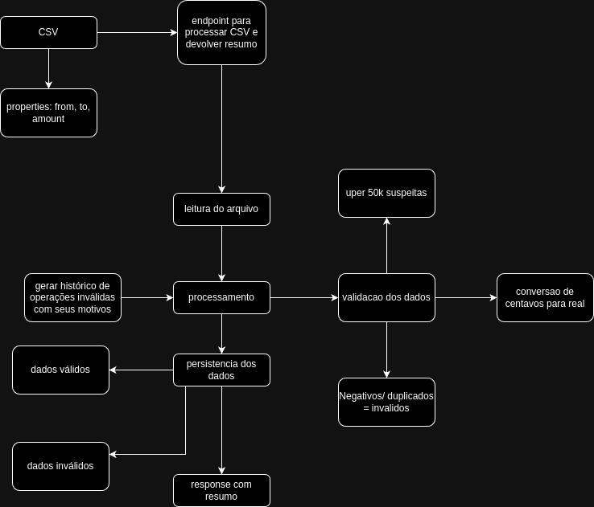

## Mevo test



## Dependenciies

docker
@nestjs/cli

## Project setup

```bash
$ npm install
```
```bash
$ npx prisma migrate dev
```

```bash
# Go to diretory 'prisma' and run
$ docker-compose up -d
```

## Compile and run the project

```bash
# development
$ npm run start

# watch mode
$ npm run start:dev

## Run tests

# unit tests
$ npm run test